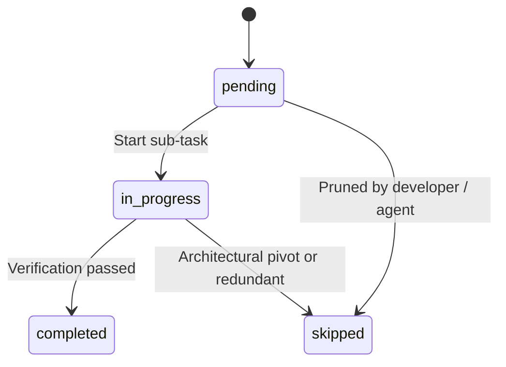
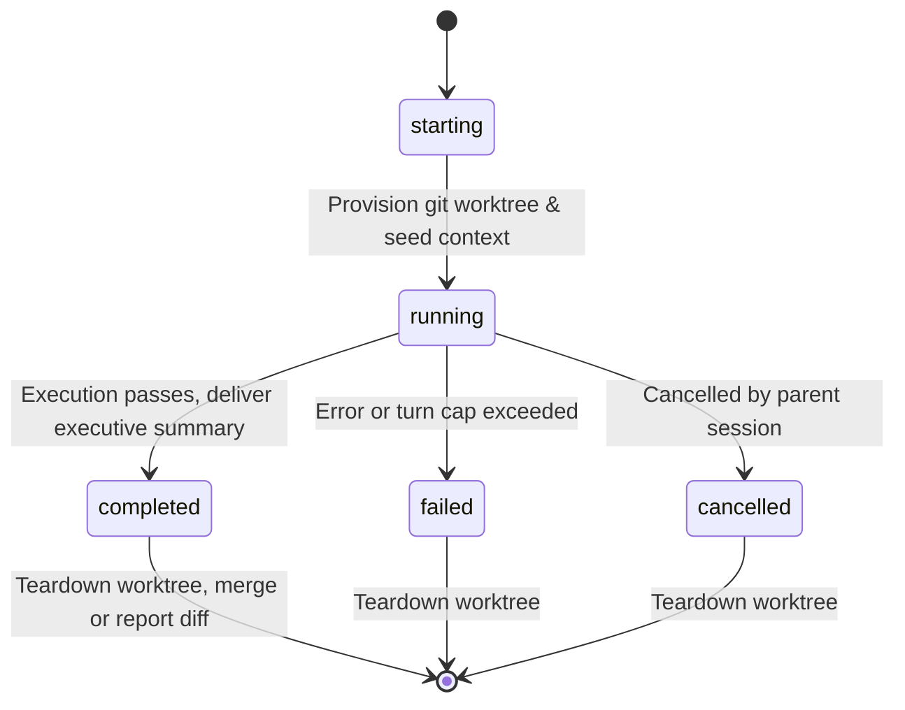

# Data Model: Claude Code Agent Harness Capabilities

This document defines the core domain entities, fields, relationships, validation rules, and state transitions for the Claude Code agent harness.

---

## 1. Domain Entities & Schemas

### 1.1 CodingTask & ChecklistItem
Represents user-directed objectives and structured progression across multi-turn workflows.

```typescript
export interface CodingTask {
  id: string; // UUID or sequential task identifier (e.g. "task-001")
  sessionId: string; // Reference to active ExecutionSession
  goal: string; // User-defined high-level objective
  status: "pending" | "in_progress" | "completed" | "failed" | "cancelled";
  createdAt: string; // ISO 8601 timestamp
  updatedAt: string; // ISO 8601 timestamp
  items: ChecklistItem[];
}

export interface ChecklistItem {
  id: string; // e.g. "CHK-001"
  taskId: string;
  order: number; // Execution sequence
  title: string; // Succinct action description
  status: "pending" | "in_progress" | "completed" | "skipped";
  skipReason?: string; // Mandatory if status is "skipped"
  outcomeSummary?: string; // Recorded upon completion
}
```

**State Transitions for ChecklistItem**:


---

### 1.2 ExecutionSession & PermissionState
Maintains runtime state, active permission mode, token tracking, and workspace boundaries.

```typescript
export type PermissionMode = "auto" | "accept_edits" | "manual";

export interface ExecutionSession {
  sessionId: string;
  permissionMode: PermissionMode;
  workspaceRoot: string; // Canonical repo root path
  currentWorkingDir: string; // Relative to workspaceRoot
  activeTurn: number;
  tokenMetrics: {
    promptTokens: number;
    completionTokens: number;
    cacheReadTokens: number;
    cacheWriteTokens: number;
    totalTokens: number;
  };
  compactionThreshold: number; // Default 0.75 (75% capacity)
  lastCompactedTurn?: number;
  activeGoal?: string;
}

export interface PermissionApprovalRequest {
  requestId: string;
  toolName: string;
  operationType: "destructive_command" | "file_deletion" | "sensitive_file" | "git_mutation";
  description: string;
  commandOrPath: string;
  proposedAction: Record<string, unknown>;
  timestamp: string;
}
```

---

### 1.3 FileCheckpoint & Rollback Snapshot
Maintains per-turn disk state snapshots to support lossless multi-step rewinds.

```typescript
export interface FileSnapshot {
  filePath: string; // Relative to workspaceRoot
  contentBefore: string; // Content before modification
  checksum: string; // SHA-256 hash
}

export interface FileCheckpoint {
  turnNumber: number;
  timestamp: string; // ISO 8601
  description: string; // Tool action that prompted the checkpoint
  modifiedFiles: FileSnapshot[];
}

export interface CheckpointStore {
  sessionId: string;
  checkpoints: Map<number, FileCheckpoint>; // turnNumber -> Checkpoint
}
```

**Validation Rules**:
- Before executing any edit in `edit_file`, `write_file`, or `notebook_edit`, if the file already exists on disk, a `FileSnapshot` MUST be created.
- Checkpoints are append-only during forward execution.
- A rollback to turn $K$ restores files to their state at checkpoint $K$ and truncates subsequent checkpoints.

---

### 1.4 CodeFinding
Structured code quality, security, and diagnostic audit reports.

```typescript
export type FindingSeverity = "critical" | "high" | "medium" | "low" | "info";
export type FindingCategory = "security" | "bug" | "performance" | "style" | "architecture";

export interface CodeFinding {
  id: string; // e.g. "FIND-001"
  filePath: string;
  startLine: number;
  endLine: number;
  severity: FindingSeverity;
  category: FindingCategory;
  title: string;
  description: string;
  failureScenario?: string;
  suggestedFix?: string;
}
```

---

### 1.5 SubagentDelegation & Worktree State
Controls specialist subagent lifecycles and git worktree isolation.

```typescript
export interface SubagentDelegation {
  delegationId: string;
  subagentName: "researcher" | "advisor" | string;
  parentSessionId: string;
  childAgentId: string;
  taskDescription: string;
  turnCap: number; // Max allowed turns (default: 15)
  requiresWrite: boolean; // If true, worktree is mandatory
  worktreePath?: string; // Set when requiresWrite is true
  worktreeBranch?: string; // e.g. "subagent/task-001-xyz"
  status: "starting" | "running" | "completed" | "failed" | "cancelled";
  resultSummary?: string;
  findings?: CodeFinding[];
}
```

**Worktree Lifecycle**:


---

### 1.6 ShellExecutionRecord & BackgroundTask
Represents synchronous and asynchronous shell commands.

```typescript
export interface ShellExecutionRecord {
  commandId: string;
  command: string;
  cwd: string;
  startedAt: string;
  completedAt?: string;
  durationMs?: number;
  exitCode?: number;
  stdout: string;
  stderr: string;
  isBackground: boolean;
  backgroundTaskId?: string;
  status: "running" | "completed" | "failed" | "timed_out" | "cancelled";
}

export interface BackgroundTask {
  taskId: string;
  pid: number;
  command: string;
  cwd: string;
  startedAt: string;
  status: "running" | "stopped" | "failed";
  logFilePath: string;
}
```
