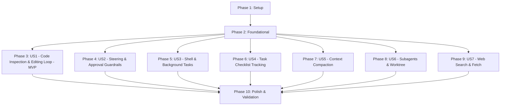

# Tasks: Claude Code Agent Harness Capabilities

**Branch**: `001-claude-code-capabilities` | **Spec**: [spec.md](file:///home/michael/Code/eve-claude-harness/specs/001-claude-code-capabilities/spec.md) | **Plan**: [plan.md](file:///home/michael/Code/eve-claude-harness/specs/001-claude-code-capabilities/plan.md)

---

## Phase 1: Setup (Shared Infrastructure)

**Purpose**: Project initialization, directory structure creation, and base type definitions.

- [X] T001 Create directory structure for tools, subagents, and library modules under `agent/tools/`, `agent/subagents/`, `agent/lib/`, and `evals/`
- [X] T002 [P] Define core shared TypeScript domain interfaces and types in `agent/lib/types.ts`
- [X] T003 [P] Verify TypeScript build and configuration settings in `tsconfig.json` and ensure `npm run typecheck` passes

---

## Phase 2: Foundational (Blocking Prerequisites)

**Purpose**: Core engine components that MUST be complete before ANY user story can be implemented.

**⚠️ CRITICAL**: No user story work can begin until this foundational phase is complete.

- [X] T004 Implement workspace path normalization and security containment helper in `agent/lib/workspace.ts` enforcing `path.relative(repoRoot, targetPath).startsWith('..') === false`
- [X] T005 [P] Implement permission inspection engine and Auto Mode policy evaluator in `agent/lib/permissions.ts` supporting modes `"auto" | "accept_edits" | "manual"`
- [X] T006 [P] Implement file snapshot and rollback store in `agent/lib/checkpoint-manager.ts` capturing `{ filePath: string, contentBefore: string, checksum: string }` per turn
- [X] T007 Implement process management and output buffer capping in `agent/lib/shell-manager.ts` with 30s timeout and 40KB output limit
- [X] T008 [P] Implement Jupyter notebook JSON cell extractor and serializer in `agent/lib/notebook-parser.ts`

**Checkpoint**: Core foundational utilities ready — user story implementation can now proceed.

---

## Phase 3: User Story 1 - Autonomous Grounded Code Inspection & Editing Loop (Priority: P1) 🎯 MVP

**Goal**: Enable the agent to locate symbols, read files with line numbering/pagination, perform atomic writes, and make exact-match string edits verified against pre-modification snapshots.

**Independent Test**: Prompt agent to search a function across directories, inspect its lines with pagination, edit an exact code snippet, and verify the resulting diff.

### Implementation for User Story 1

- [X] T009 [P] [US1] Implement bounded file reader tool with line numbering, offset, and limit pagination in `agent/tools/read_file.ts`
- [X] T010 [P] [US1] Implement regex content search tool with ripgrep compatibility in `agent/tools/grep.ts`
- [X] T011 [P] [US1] Implement pattern-based file matching tool in `agent/tools/glob.ts`
- [X] T012 [US1] Implement atomic file creation and overwrite tool with recursive directory auto-creation in `agent/tools/write_file.ts`
- [X] T013 [US1] Implement exact-match file editing tool with target validation and uniqueness checking in `agent/tools/edit_file.ts`
- [X] T014 [P] [US1] Implement Jupyter notebook cell inspection and editing tool in `agent/tools/notebook_edit.ts`
- [X] T015 [US1] Author behavioral evaluation suite verifying the perception-action-verification loop in `evals/coding-loop.eval.ts`

**Checkpoint**: User Story 1 is fully functional and testable as a standalone MVP.

---

## Phase 4: User Story 2 - Interactive Steering & Approval Guardrails (Priority: P1)

**Goal**: Equip the agent with interactive disambiguation questions and human-in-the-loop approval gates for destructive operations, along with session-wide file rollback.

**Independent Test**: Prompt agent with an ambiguous design choice or a destructive deletion request; verify it pauses for multiple-choice input or approval confirmation before proceeding, and can rewind changes.

### Implementation for User Story 2

- [X] T016 [P] [US2] Implement interactive clarification tool supporting single-select and multi-select menus with write-in options in `agent/tools/ask_question.ts`
- [X] T017 [US2] Wire dynamic approval gates into `agent/lib/permissions.ts` to intercept destructive operations (`rm`, `git reset`, `.env` modifications) with human confirmation
- [X] T018 [US2] Implement file checkpoint rollback and rewind tool in `agent/tools/rewind.ts` reverting modified files back to state at specified historical turn
- [X] T019 [P] [US2] Author behavioral evaluation suite verifying Auto Mode approval gates and steering in `evals/approval-gates.eval.ts`

**Checkpoint**: User Stories 1 and 2 deliver grounded coding with developer steering and fail-safe safety gates.

---

## Phase 5: User Story 3 - Shell Execution & Asynchronous Process Management (Priority: P2)

**Goal**: Enable synchronous shell command execution with persistent working directory tracking and background task monitoring for long-running servers and watchers.

**Independent Test**: Run a synchronous build command capturing stdout/stderr and exit code; launch a mock background server, verify background task status, send input, and terminate it.

### Implementation for User Story 3

- [X] T020 [US3] Implement native shell execution tool with persistent cwd tracking and workspace root containment in `agent/tools/bash.ts`
- [X] T021 [US3] Implement background process manager tool (`list`, `status`, `kill`, `send_input`) in `agent/tools/background_task.ts`
- [X] T022 [P] [US3] Author behavioral evaluation suite for shell execution, timeouts, and background task management in `evals/shell-execution.eval.ts`

**Checkpoint**: Shell execution and background task lifecycle management are fully operational.

---

## Phase 6: User Story 4 - Multi-Turn Task Checklist & Observable Progress (Priority: P2)

**Goal**: Provide structured, observable multi-step task tracking (`TaskCreate`, `TaskGet`, `TaskList`, `TaskUpdate`) across multi-turn sessions.

**Independent Test**: Initialize a 5-step task checklist, transition items from `pending` to `in_progress` to `completed` or `skipped`, and verify status persistence.

### Implementation for User Story 4

- [X] T023 [US4] Implement structured task checklist management tool (`init`, `list`, `get`, `update`) in `agent/tools/task_tracker.ts`
- [X] T024 [P] [US4] Implement structured code quality, security, and audit finding reporting tool in `agent/tools/report_findings.ts`
- [X] T025 [P] [US4] Author behavioral evaluation suite for checklist progression and findings reporting in `evals/task-tracker.eval.ts`

**Checkpoint**: Observable task checklists and structured findings reporting are operational.

---

## Phase 7: User Story 5 - Intelligent Context Compaction & Token Optimization (Priority: P3)

**Goal**: Automatically monitor context window utilization, triggering high-fidelity compaction at 75% capacity and on-demand via command to prune stale logs while preserving active goals and rules.

**Independent Test**: Simulate extended conversation history crossing 75% capacity; verify compaction summarizes past actions, prunes verbose stdout, and maintains active project memory.

### Implementation for User Story 5

- [X] T026 [US5] Implement token utilization estimator and compaction summarizer in `agent/lib/compaction.ts` preserving task goals, modified files, and prompt cache boundaries
- [X] T027 [US5] Integrate automated 75% threshold compaction trigger into conversation turn cycle in `agent/agent.ts`
- [X] T028 [P] [US5] Implement explicit on-demand `/compact` command capability in `agent/instructions.md`

**Checkpoint**: Context window compaction operates reliably to prevent context overflow.

---

## Phase 8: User Story 6 - Specialized Subagent Delegation & Peer Advice (Priority: P3)

**Goal**: Enable delegating read-only codebase exploration to a researcher subagent, architectural consultations to an advisor subagent, and code authoring to git-worktree isolated worker subagents.

**Independent Test**: Delegate a codebase search query to `researcher`, consult `advisor` on a design dilemma, and launch a worker subagent in an isolated git worktree.

### Implementation for User Story 6

- [X] T029 [P] [US6] Author read-only researcher subagent definition and prompt in `agent/subagents/researcher/agent.ts` and `agent/subagents/researcher/instructions.md`
- [X] T030 [P] [US6] Author architectural advisor subagent definition with Opus 5.5 and high reasoning in `agent/subagents/advisor/agent.ts` and `agent/subagents/advisor/instructions.md`
- [X] T031 [US6] Implement Git worktree isolation helper for modifying subagents in `agent/lib/worktree.ts` managing branch provisioning and cleanup
- [X] T032 [P] [US6] Author behavioral evaluation suite verifying subagent delegation and isolation in `evals/subagents.eval.ts`

**Checkpoint**: Specialist subagents and worktree isolation operate independently.

---

## Phase 9: User Story 7 - Web Documentation Search & Content Extraction (Priority: P3)

**Goal**: Equip the agent to query authoritative technical documentation and extract clean markdown content for external SDKs and libraries.

**Independent Test**: Prompt agent to search for an external API guide, fetch the documentation URL, and extract clean markdown text.

### Implementation for User Story 7

- [X] T033 [P] [US7] Implement authoritative technical web search tool with domain filtering in `agent/tools/web_search.ts`
- [X] T034 [P] [US7] Implement web URL content fetcher converting HTML to clean markdown text in `agent/tools/web_fetch.ts`

**Checkpoint**: Web documentation search and content ingestion are operational.

---

## Phase 10: Polish & Cross-Cutting Concerns

**Purpose**: Agent instructions refinement, system prompt guidelines, end-to-end quickstart validation, and documentation updates.

- [X] T035 [US1] Update master system instructions with tool usage guidelines, perception-action-verification loop rules, and safety protocols in `agent/instructions.md`
- [X] T036 Run end-to-end quickstart scenarios in `specs/001-claude-code-capabilities/quickstart.md` using `eve dev`
- [X] T037 [P] Run full TypeScript typecheck (`npm run typecheck`) and verify zero errors
- [X] T038 Execute complete evaluation suite (`eve eval`) and verify all test cases pass

---

## Dependencies & Execution Order

### Phase Dependencies

### User Story Dependencies

- **User Story 1 (P1)**: Depends on Phase 2 (workspace, permissions, checkpoint-manager). Blocks nothing else.
- **User Story 2 (P1)**: Depends on Phase 2. Complements US1 with approval gates and rewind capabilities.
- **User Story 3 (P2)**: Depends on Phase 2 (shell-manager).
- **User Story 4 (P2)**: Depends on Phase 2 (types).
- **User Story 5 (P3)**: Depends on Phase 2 (types).
- **User Story 6 (P3)**: Depends on Phase 2 (workspace, worktree).
- **User Story 7 (P3)**: Depends on Phase 2 (types).

---

## Parallel Opportunities

- **Phase 1**: T002 and T003 can run in parallel.
- **Phase 2**: T005, T006, and T008 can run in parallel once T004 is established.
- **Phase 3 (US1)**: T009, T010, T011, and T014 can run concurrently in parallel before T012 and T013.
- **User Story Level**: Once Phase 2 is complete, US1, US2, and US3 can proceed concurrently across independent files.
- **Phase 8 (US6)**: T029 (`researcher`) and T030 (`advisor`) are completely independent files and can be authored in parallel.
- **Phase 9 (US7)**: T033 (`web_search`) and T034 (`web_fetch`) can run in parallel.

---

## Implementation Strategy (MVP First)

1. **MVP Milestone (Phases 1, 2, and 3)**:
   - Complete Setup and Foundational prerequisites.
   - Implement Phase 3 (User Story 1): `read_file`, `edit_file`, `write_file`, `grep`, `glob`, `notebook_edit`.
   - **Validate MVP**: Test code inspection and exact editing on real project files.
2. **Safety & Execution Milestone (Phases 4 and 5)**:
   - Add Auto Mode approval gates, `ask_question`, `rewind`, `bash`, and `background_task`.
3. **Tracking, Scaling & Multi-Agent Milestone (Phases 6, 7, 8, and 9)**:
   - Add `task_tracker`, `report_findings`, context compaction, `researcher`, `advisor`, worktree isolation, and web search/fetch.
4. **Final Polish & Evaluation (Phase 10)**:
   - System prompt instructions update, `quickstart.md` verification, `typecheck`, and `eve eval`.
